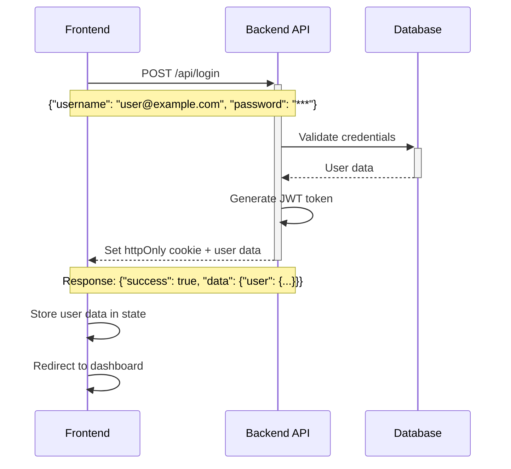
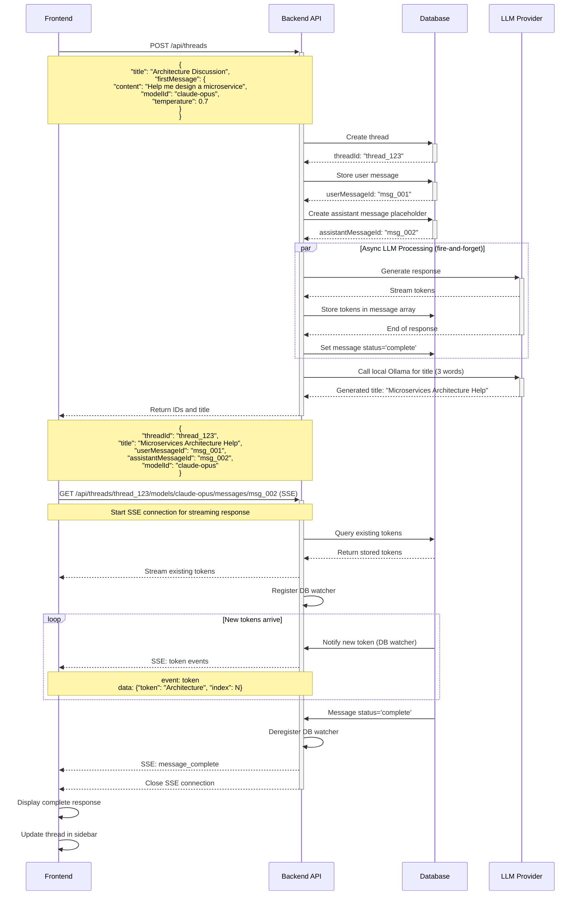
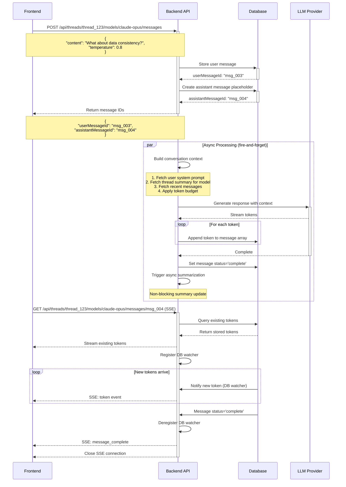
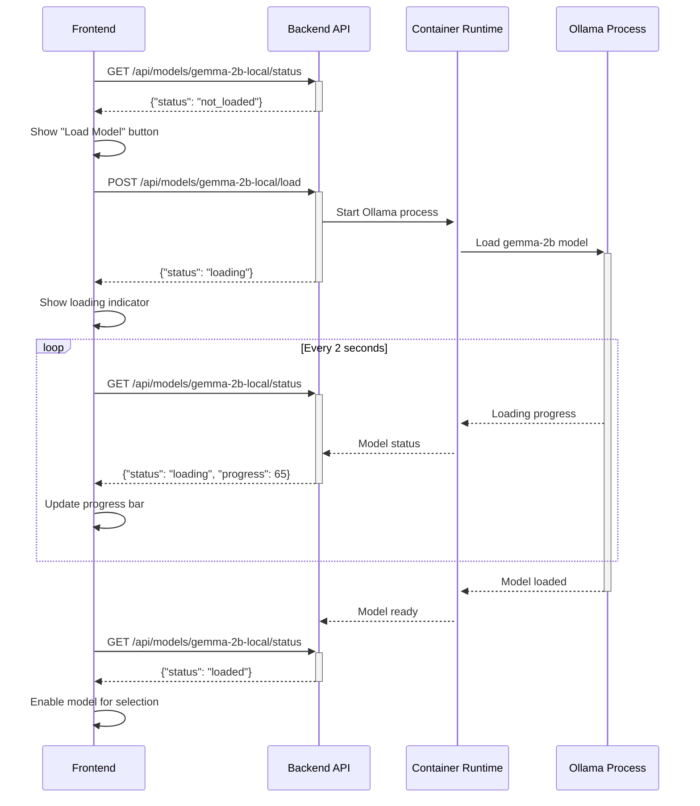
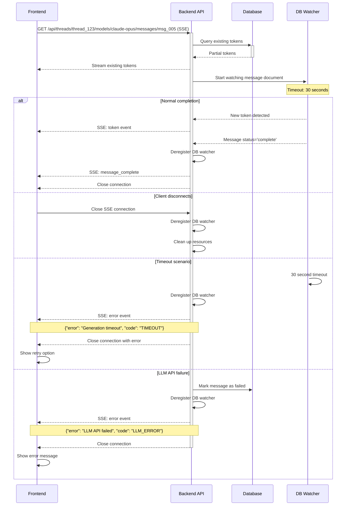

# Frontend-Backend Integration Guide

This document outlines the integration patterns between the frontend and backend systems, including sequence diagrams for key user flows and technical implementation details.

## 1. Core Integration Patterns

The system uses an **async streaming architecture** where:
- API calls return immediately with tracking IDs (except title generation blocks briefly)
- LLM processing happens asynchronously in the background
- Real-time updates are delivered via Server-Sent Events (SSE)
- DB watchers handle token streaming with explicit deregistration on completion or disconnect

## 2. Authentication Flow



## 3. New Thread Creation with First Message



## 4. Continuing Conversation



## 5. Model Loading Flow



## 6. Error Handling and Timeouts



## 7. Frontend State Management Integration

### Zustand Store Updates

```typescript
interface MessageState {
  // Streaming message tracking
  activeStreams: Map<string, {
    messageId: string;
    tokens: string[];
    isComplete: boolean;
    sseConnection?: EventSource;
  }>;

  // Actions
  startMessageStream: (messageId: string) => void;
  appendStreamingToken: (messageId: string, token: string) => void;
  completeMessage: (messageId: string, totalTokens: number) => void;
  handleStreamError: (messageId: string, error: Error) => void;
}
```

### Frontend SSE Client

```typescript
class MessageStreamClient {
  private eventSource: EventSource;
  private messageId: string;
  private timeout: number = 30000; // 30 seconds

  connect(threadId: string, modelId: string, messageId: string) {
    const url = `/api/threads/${threadId}/models/${modelId}/messages/${messageId}`;
    this.eventSource = new EventSource(url);

    this.eventSource.addEventListener('token', (event) => {
      const data = JSON.parse(event.data);
      this.onToken(data.token, data.index);
    });

    this.eventSource.addEventListener('message_complete', (event) => {
      const data = JSON.parse(event.data);
      this.onComplete(data.totalTokens);
      this.close();
    });

    this.eventSource.addEventListener('error', (event) => {
      const data = JSON.parse(event.data);
      this.onError(new Error(data.error));
      this.close();
    });

    // Client-side timeout
    setTimeout(() => {
      if (this.eventSource.readyState === EventSource.OPEN) {
        this.onTimeout();
        this.close();
      }
    }, this.timeout);
  }

  close() {
    this.eventSource?.close();
  }
}
```

## 8. Performance Considerations

### Connection Management
- Limit concurrent SSE connections per user (max 3)
- Implement connection pooling for backend
- Use HTTP/2 for multiplexed connections
- Explicit DB watcher deregistration to prevent resource leaks

### Memory Management
- Clean up completed message streams from frontend state
- Implement token array size limits in DB (max 10,000 tokens)
- Use cursor-based pagination for message history
- Deregister DB watchers on completion, disconnect, or timeout
- Track active watchers to prevent resource exhaustion

## 10. Testing Strategy

### Integration Tests
- Mock LLM providers for deterministic responses
- Test DB watcher timeout scenarios
- Verify SSE connection cleanup
- Test concurrent message streaming

### End-to-End Tests
- Full conversation flows with real streaming
- Model loading and switching scenarios
- Network failure recovery
- Performance under load

## 11. Security Considerations

### SSE Security
- JWT validation on SSE connections
- Rate limiting per user and IP
- Message ownership verification
- XSS protection in token content

### Data Privacy
- Token content sanitization
- Secure message storage encryption
- Audit logging for message access
- API key encryption in transit and at rest
