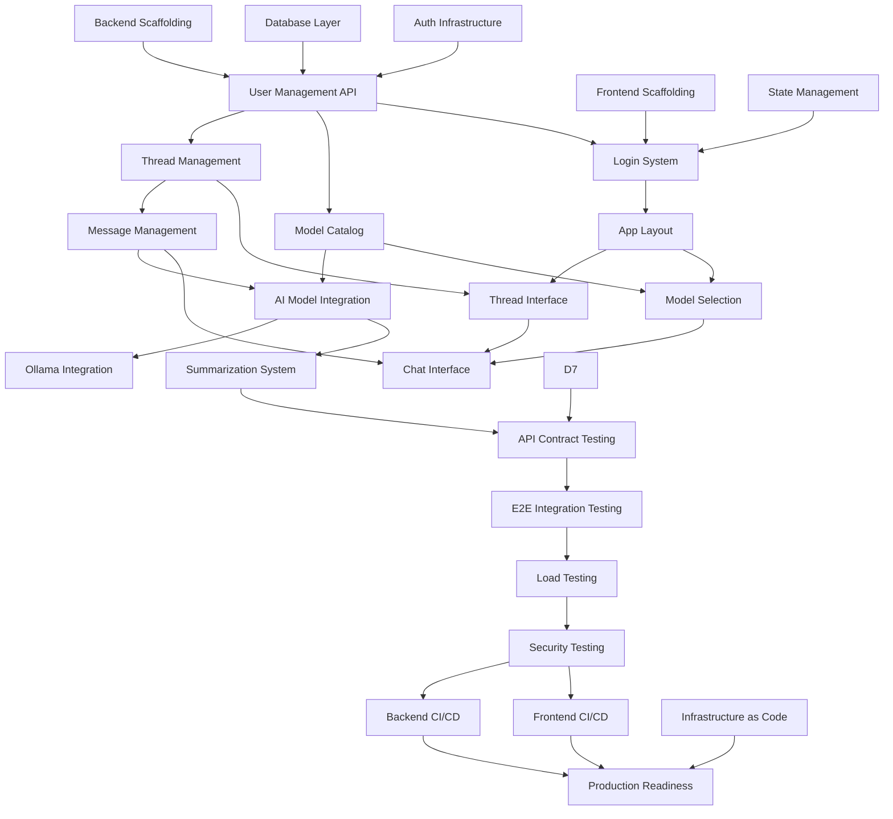

# LLM Chat Platform - Implementation Roadmap

A comprehensive task breakdown designed for autonomous coding agents with clear dependencies and parallel execution opportunities.

## Table of Contents

1. [Overview & Execution Strategy](#1-overview--execution-strategy)
2. [Task Architecture & Dependencies](#2-task-architecture--dependencies)
3. [Work Streams & Parallel Execution](#3-work-streams--parallel-execution)
4. [Infrastructure Foundation Tasks](#4-infrastructure-foundation-tasks)
5. [Backend Core Development Tasks](#5-backend-core-development-tasks)
6. [Frontend Core Development Tasks](#6-frontend-core-development-tasks)
7. [Integration & Testing Tasks](#7-integration--testing-tasks)
8. [Deployment & Operations Tasks](#8-deployment--operations-tasks)
9. [Task Dependencies Matrix](#9-task-dependencies-matrix)
10. [Critical Path Analysis](#10-critical-path-analysis)
11. [Resource Requirements](#11-resource-requirements)
12. [Milestone Gates & Acceptance Criteria](#12-milestone-gates--acceptance-criteria)

---

## 1. Overview & Execution Strategy

### Architecture Principles
- **Two-Repository Strategy**: Independent backend (Node.js/Express) and frontend (React/Vite) repositories
- **Container-First Backend**: Single container with Node.js API server and Ollama process
- **Firebase Integration**: Realtime Database for production, Emulator Suite for development/testing
- **TDD Methodology**: All tasks require failing tests written first, then implementation
- **Contract-First API**: API specifications defined before implementation

### Task Design Philosophy
- **Atomic Tasks**: Each task is self-contained and can be completed in 2-4 hours
- **Self-Sufficient Prompts**: Each task prompt contains all necessary context and specifications
- **Clear Acceptance Criteria**: Every task has measurable completion criteria
- **Parallel Execution**: Tasks designed to minimize blocking dependencies
- **Testable Units**: All tasks produce testable, verifiable outputs

### Execution Model
- Tasks can be executed by autonomous coding agents (like Claude Code)
- Each task prompt includes complete technical specifications
- Dependency verification built into task prompts
- Automated testing and validation at each step

---

## 2. Task Architecture & Dependencies

### Dependency Types
1. **Hard Dependencies**: Task B cannot start until Task A is complete
2. **Soft Dependencies**: Task B benefits from Task A but can start independently
3. **Resource Dependencies**: Tasks requiring the same external resources
4. **Interface Dependencies**: Tasks that must align on shared contracts/APIs

### Repository Organization
```
Backend Repository (llm-chat-backend):
├── Foundation Layer (Parallel)
├── Core Services Layer (Sequential within, Parallel across)
├── Integration Layer (Depends on Core Services)
└── Deployment Layer (Depends on Integration)

Frontend Repository (llm-chat-frontend):
├── Foundation Layer (Parallel with Backend Foundation)
├── Core Components Layer (Parallel within, Sequential dependency on Foundation)
├── Integration Layer (Depends on Backend API contracts)
└── Deployment Layer (Parallel with Backend Deployment)
```

---

## 3. Work Streams & Parallel Execution

### Stream A: Backend Foundation & Infrastructure
**Duration**: ~16 hours (4 parallel tasks × 4 hours each)
**Parallel Execution**: All tasks can run simultaneously

### Stream B: Frontend Foundation & Infrastructure
**Duration**: ~16 hours (4 parallel tasks × 4 hours each)
**Parallel Execution**: All tasks can run simultaneously, independent of Stream A

### Stream C: Backend Core Services
**Duration**: ~24 hours (Sequential execution required)
**Dependencies**: Requires Stream A completion

### Stream D: Frontend Core Components
**Duration**: ~20 hours (Mostly parallel within sub-streams)
**Dependencies**: Requires Stream B completion, some tasks depend on Stream C API contracts

### Stream E: Integration & Testing
**Duration**: ~12 hours (Sequential execution)
**Dependencies**: Requires both Stream C and Stream D partial completion

### Stream F: Deployment & Operations
**Duration**: ~8 hours (Parallel execution possible)
**Dependencies**: Requires all previous streams completion

---

## 4. Infrastructure Foundation Tasks

### Stream A: Backend Foundation (Parallel Execution)

#### Task A1: Backend Repository Scaffolding & Development Environment
**Duration**: 4 hours
**Dependencies**: None
**Parallel**: Can run with A2, A3, A4

**Objective**: Create complete backend repository structure with development tools

**Deliverables**:
- Repository structure (`src/`, `tests/`, `migrations/`, `scripts/`, `docs/`)
- Package.json with all dependencies (Node.js LTS, Express, TypeScript, testing frameworks)
- TypeScript configuration with strict settings
- ESLint and Prettier configuration
- Development scripts (`start:dev`, `start:test`, `start:ci`)
- Docker development setup with docker-compose.yml
- Environment configuration (.env.example, config validation)
- Basic health check endpoint (`GET /api/health`)
- README with setup instructions

**Testing Requirements**:
- Unit test for health endpoint
- Integration test for development environment startup
- Linting and type-checking in CI

**Acceptance Criteria**:
- `npm run start:test` starts server with in-memory database
- `docker-compose up` provides full development environment
- Health endpoint returns 200 with service status
- All tests pass, linting clean, TypeScript compiles without errors

#### Task A2: Database Abstraction Layer & Firebase Integration
**Duration**: 4 hours
**Dependencies**: None
**Parallel**: Can run with A1, A3, A4

**Objective**: Create database abstraction layer supporting both Firebase Realtime Database and Firebase Emulator

**Deliverables**:
- Database interface definitions (TypeScript interfaces)
- Firebase Realtime Database adapter implementation
- Firebase Emulator configuration and startup scripts
- Connection management and error handling
- Database health check integration
- Migration system framework
- Seed data system for testing

**Testing Requirements**:
- Unit tests for database adapter methods
- Integration tests with Firebase Emulator
- Connection failure and recovery tests
- Data integrity validation tests

**Acceptance Criteria**:
- Database adapter connects to both production Firebase and local emulator
- Migration system can create and manage schema versions
- Seed data populates test databases consistently
- Health check accurately reports database status

#### Task A3: Authentication & Security Infrastructure
**Duration**: 4 hours
**Dependencies**: None
**Parallel**: Can run with A1, A2, A4

**Objective**: Implement JWT-based authentication with security middleware

**Deliverables**:
- JWT token generation and validation utilities
- Authentication middleware for Express routes
- Password hashing with bcrypt
- Security middleware (helmet, cors, rate limiting)
- API key encryption/decryption utilities using GCP KMS or local encryption
- Session management with httpOnly cookies
- Security configuration and validation

**Testing Requirements**:
- Unit tests for JWT utilities and encryption functions
- Integration tests for authentication flows
- Security middleware behavior tests
- Rate limiting and attack simulation tests

**Acceptance Criteria**:
- JWT tokens generated and validated correctly
- API keys encrypted/decrypted securely
- Authentication middleware properly protects routes
- Security headers and rate limiting active
- Password hashing follows security best practices

#### Task A4: Logging, Monitoring & Error Handling Infrastructure
**Duration**: 4 hours
**Dependencies**: None
**Parallel**: Can run with A1, A2, A3

**Objective**: Implement comprehensive logging, monitoring, and error handling

**Deliverables**:
- Structured logging system with winston or similar
- Error handling middleware with proper HTTP status codes
- Request/response logging with correlation IDs
- Performance monitoring and metrics collection
- Health check system for all service dependencies
- Environment-specific logging configurations
- Error tracking and reporting system integration

**Testing Requirements**:
- Unit tests for logging utilities and error handlers
- Integration tests for monitoring endpoints
- Error scenario simulation and validation
- Log format and correlation ID validation

**Acceptance Criteria**:
- All errors properly categorized and logged with context
- Health check endpoint reports comprehensive system status
- Request correlation IDs tracked through entire request lifecycle
- Monitoring provides actionable insights into system performance

---

### Stream B: Frontend Foundation (Parallel Execution)

#### Task B1: Frontend Repository Scaffolding & Build System
**Duration**: 4 hours
**Dependencies**: None
**Parallel**: Can run with B2, B3, B4 and all Stream A tasks

**Objective**: Create complete frontend repository with modern React development setup

**Deliverables**:
- Repository structure (`src/`, `tests/`, `public/`, `docs/`)
- Vite + React + TypeScript configuration
- Material-UI integration with custom theme
- Tailwind CSS integration and configuration
- Testing setup (Vitest, React Testing Library, Playwright)
- Development and build scripts
- Environment configuration for different stages
- Basic routing setup with React Router
- Version display component reading from build-time environment

**Testing Requirements**:
- Unit tests for core utilities and components
- Build process validation tests
- Environment configuration tests
- Basic routing functionality tests

**Acceptance Criteria**:
- `npm run dev` starts development server with hot reload
- `npm run build` creates optimized production build
- `npm run test` runs all tests successfully
- TypeScript compilation and linting pass
- Version information displayed in UI

#### Task B2: State Management & Data Layer Architecture
**Duration**: 4 hours
**Dependencies**: None
**Parallel**: Can run with B1, B3, B4 and all Stream A tasks

**Objective**: Implement client-side state management and API client architecture

**Deliverables**:
- Zustand stores for different application domains
- API client with proper error handling and retry logic
- HTTP interceptors for authentication and error handling
- Real-time data synchronization patterns
- Client-side caching strategy
- State persistence for offline support
- Type-safe API client with generated types

**Testing Requirements**:
- Unit tests for all store actions and selectors
- API client integration tests with mock server
- State persistence and rehydration tests
- Error handling and retry logic tests

**Acceptance Criteria**:
- State management handles all application use cases
- API client properly handles authentication and errors
- Client-side caching improves performance
- State persists across browser sessions when appropriate

#### Task B3: Design System & Component Library
**Duration**: 4 hours
**Dependencies**: None
**Parallel**: Can run with B1, B2, B4 and all Stream A tasks

**Objective**: Create comprehensive design system and reusable component library

**Deliverables**:
- Material-UI theme customization
- Reusable component library (buttons, inputs, modals, etc.)
- Responsive design breakpoints and utilities
- Icon system and asset management
- Typography and spacing system
- Color palette and semantic color tokens
- Component documentation with Storybook or similar

**Testing Requirements**:
- Visual regression tests for all components
- Accessibility tests (ARIA, keyboard navigation)
- Responsive behavior tests across breakpoints
- Component API contract tests

**Acceptance Criteria**:
- All components follow consistent design patterns
- Components are accessible and meet WCAG guidelines
- Responsive design works across all target devices
- Component library is well-documented and reusable

#### Task B4: Frontend Security & Performance Infrastructure
**Duration**: 4 hours
**Dependencies**: None
**Parallel**: Can run with B1, B2, B3 and all Stream A tasks

**Objective**: Implement frontend security measures and performance optimizations

**Deliverables**:
- Content Security Policy configuration
- XSS and CSRF protection measures
- Secure token storage and handling
- Code splitting and lazy loading setup
- Image optimization and asset management
- Performance monitoring integration
- Service worker for caching (optional)

**Testing Requirements**:
- Security vulnerability scanning tests
- Performance benchmarking and regression tests
- Bundle analysis and optimization validation
- Service worker functionality tests (if implemented)

**Acceptance Criteria**:
- Security headers and CSP properly configured
- No security vulnerabilities in dependencies
- Application loads within performance budgets
- Code splitting reduces initial bundle size
- Assets are optimized for production delivery

---

## 5. Backend Core Development Tasks

### Stream C: Backend Core Services (Sequential Dependencies)

#### Task C1: User Management & Authentication API
**Duration**: 4 hours
**Dependencies**: Tasks A1, A2, A3 completed

**Objective**: Implement complete user authentication system with admin user management

**Deliverables**:
- User CRUD operations in database layer
- Authentication endpoints (login, logout, refresh)
- Admin CLI utility for user creation (`scripts/add-user`)
- Cloud Function for production user management
- Password security and validation
- User profile management endpoints
- API key storage and retrieval with encryption

**API Endpoints**:
- `POST /api/auth/login` - User login with credentials
- `POST /api/auth/logout` - User logout and token invalidation
- `POST /api/auth/refresh` - Token refresh
- `GET /api/user/profile` - Get user profile
- `PUT /api/user/profile` - Update user profile
- `PUT /api/user/api-keys` - Update encrypted API keys

**Testing Requirements**:
- Unit tests for all authentication functions
- Integration tests for complete auth flows
- Security tests for token handling and encryption
- Admin CLI utility tests

**Acceptance Criteria**:
- User can log in and receive valid JWT tokens
- Admin can create users via CLI and Cloud Function
- API keys are stored encrypted and can be retrieved securely
- All authentication security requirements met

#### Task C2: Thread Management & CRUD Operations
**Duration**: 4 hours
**Dependencies**: Task C1 completed

**Objective**: Implement thread management with full CRUD operations and pagination

**Deliverables**:
- Thread CRUD operations (create, read, update, delete)
- Cursor-based pagination system
- Thread search functionality (title and content)
- Thread metadata management
- User authorization for thread operations
- Soft delete functionality
- Thread archiving system

**API Endpoints**:
- `GET /api/threads` - List user threads with pagination and search
- `POST /api/threads` - Create new thread
- `GET /api/threads/:id` - Get specific thread details
- `PUT /api/threads/:id` - Update thread metadata
- `DELETE /api/threads/:id` - Delete thread (soft delete)
- `POST /api/threads/:id/archive` - Archive/unarchive thread

**Testing Requirements**:
- Unit tests for all thread operations
- Integration tests for pagination and search
- Authorization tests for thread access control
- Performance tests for large thread lists

**Acceptance Criteria**:
- Users can create, read, update, delete their threads
- Pagination works efficiently with large datasets
- Search returns relevant results quickly
- Thread authorization prevents unauthorized access

#### Task C3: Message Management & Context Assembly
**Duration**: 4 hours
**Dependencies**: Task C2 completed

**Objective**: Implement message storage, retrieval, and conversation context management

**Deliverables**:
- Message CRUD operations with thread association
- Conversation context assembly for AI models
- Token counting and context window management
- Message pagination with cursor-based navigation
- Message metadata (timestamps, model info, token counts)
- Conversation history optimization
- Message search within threads

**API Endpoints**:
- `GET /api/threads/:threadId/messages` - Get messages with pagination
- `POST /api/threads/:threadId/messages` - Create new message
- `GET /api/messages/:id` - Get specific message
- `DELETE /api/messages/:id` - Delete message
- `POST /api/threads/:threadId/context` - Get assembled context for AI model

**Testing Requirements**:
- Unit tests for message operations and context assembly
- Integration tests for conversation flows
- Performance tests for large message histories
- Token counting accuracy tests

**Acceptance Criteria**:
- Messages stored and retrieved efficiently with pagination
- Conversation context assembled correctly for each model
- Token limits enforced and context trimmed appropriately
- Message operations maintain data integrity

#### Task C4: Model Configuration & Catalog Management
**Duration**: 3 hours
**Dependencies**: Task C1 completed (can run parallel with C2)

**Objective**: Implement model catalog management and configuration system

**Deliverables**:
- Model configuration storage and retrieval
- Model catalog seeding via migrations
- Dynamic model configuration updates
- Model availability and status tracking
- Temperature and parameter management per model
- API key requirement validation for models

**API Endpoints**:
- `GET /api/models` - Get available models catalog
- `GET /api/models/:id` - Get specific model configuration
- `GET /api/models/:id/status` - Get model availability status
- `PUT /api/models/:id` - Update model configuration (admin only)

**Testing Requirements**:
- Unit tests for model catalog operations
- Integration tests for model configuration validation
- Tests for API key requirement checking
- Model status tracking tests

**Acceptance Criteria**:
- Model catalog accurately represents available models
- Model configurations properly validated
- API key requirements enforced for premium models
- Model status accurately reflects availability

#### Task C5: AI Model Integration & Proxy Layer
**Duration**: 6 hours
**Dependencies**: Tasks C3, C4 completed

**Objective**: Implement unified AI model proxy supporting multiple providers with streaming

**Deliverables**:
- Provider adapters for Claude, OpenAI, Google AI, Ollama
- Unified request/response interface
- Streaming response handling via Server-Sent Events
- Error handling and retry logic per provider
- Rate limiting and usage tracking
- Response caching (where appropriate)
- Model-specific parameter handling

**API Endpoints**:
- `POST /api/threads/:threadId/models/:modelId/messages` - Send message to model (streaming)
- `POST /api/models/:modelId/chat` - Direct model chat (for testing)
- `GET /api/models/:modelId/usage` - Get usage statistics

**Testing Requirements**:
- Unit tests for each provider adapter
- Integration tests with actual model APIs (using test keys)
- Streaming response tests
- Error handling and retry tests
- Rate limiting validation tests

**Acceptance Criteria**:
- All supported models work through unified interface
- Streaming responses delivered in real-time
- Provider errors handled gracefully with retries
- Rate limiting prevents API abuse

#### Task C6: Ollama Integration & Model Loading
**Duration**: 4 hours
**Dependencies**: Task C5 completed

**Objective**: Implement Ollama integration for local model execution

**Deliverables**:
- Ollama process management within container
- Model downloading and loading system
- Model status tracking and progress reporting
- Process supervision and restart logic
- Resource monitoring for Ollama process
- Model unloading and memory management

**API Endpoints**:
- `POST /api/models/:modelId/load` - Load local model
- `GET /api/models/:modelId/status` - Get model loading status
- `POST /api/models/:modelId/unload` - Unload model to free memory
- `GET /api/ollama/health` - Ollama process health

**Testing Requirements**:
- Unit tests for Ollama process management
- Integration tests for model loading/unloading
- Process supervision and restart tests
- Resource monitoring validation tests

**Acceptance Criteria**:
- Ollama models load successfully within container
- Model loading progress reported accurately to clients
- Process supervision maintains Ollama availability
- Resource usage monitored and controlled

#### Task C7: Summarization & Title Generation System
**Duration**: 4 hours
**Dependencies**: Tasks C5, C6 completed

**Objective**: Implement automatic summarization and title generation with async processing

**Deliverables**:
- Synchronous title generation using local Ollama
- Asynchronous conversation summarization
- Summarization job tracking and status
- Manual summarization endpoint
- Configurable summarization triggers
- Summary storage and retrieval

**API Endpoints**:
- `POST /api/threads/:threadId/summarize` - Manual summarization trigger
- `GET /api/threads/:threadId/models/:modelId/summary` - Get current summary
- `PUT /api/threads/:threadId/models/:modelId/summary` - Update summary
- `GET /api/summarization/jobs/:jobId` - Get summarization job status

**Testing Requirements**:
- Unit tests for summarization logic
- Integration tests for async processing
- Job tracking and status tests
- Manual vs automatic summarization tests

**Acceptance Criteria**:
- Titles generated synchronously during thread creation
- Summaries generated asynchronously without blocking responses
- Summarization jobs tracked and reportable
- Manual summarization works on demand

---

## 6. Frontend Core Development Tasks

### Stream D: Frontend Core Components (Mixed Dependencies)

#### Task D1: Authentication & Login System
**Duration**: 3 hours
**Dependencies**: Tasks B1, B2 completed; Task C1 API contracts defined

**Objective**: Implement complete login system with JWT token management

**Deliverables**:
- Login page with form validation
- JWT token storage and management
- Authentication state management
- Route protection (PrivateRoute component)
- Login error handling and user feedback
- Logout functionality
- Token refresh handling

**Components**:
- `LoginPage` - Main login interface
- `LoginForm` - Form with validation
- `AuthGuard` - Route protection wrapper
- `LogoutButton` - User logout functionality

**Testing Requirements**:
- Unit tests for all authentication components
- Integration tests with mock authentication API
- Form validation and error handling tests
- Route protection behavior tests

**Acceptance Criteria**:
- Users can log in with valid credentials
- Invalid login attempts show appropriate errors
- Authentication state persists across browser sessions
- Protected routes redirect unauthenticated users

#### Task D2: Application Layout & Navigation
**Duration**: 3 hours
**Dependencies**: Tasks B1, B3 completed

**Objective**: Create main application layout with responsive navigation

**Deliverables**:
- Main application layout component
- Responsive sidebar navigation
- Top navigation bar with user controls
- Mobile-friendly navigation drawer
- Navigation state management
- Theme toggle functionality (if applicable)

**Components**:
- `AppLayout` - Main layout wrapper
- `Sidebar` - Navigation sidebar
- `TopBar` - Header with user controls
- `NavigationDrawer` - Mobile navigation

**Testing Requirements**:
- Responsive behavior tests across breakpoints
- Navigation state management tests
- Accessibility tests for navigation components
- Mobile navigation functionality tests

**Acceptance Criteria**:
- Layout is responsive across all target devices
- Navigation works on both desktop and mobile
- User controls are accessible from all pages
- Navigation state managed consistently

#### Task D3: Thread Management Interface
**Duration**: 4 hours
**Dependencies**: Tasks D2 completed; Task C2 API contracts defined

**Objective**: Implement complete thread management UI with CRUD operations

**Deliverables**:
- Thread list with pagination
- Thread creation dialog
- Thread editing functionality
- Thread deletion with confirmation
- Thread search and filtering
- Thread archiving interface
- Empty states and loading indicators

**Components**:
- `ThreadList` - Paginated thread listing
- `ThreadItem` - Individual thread display
- `CreateThreadDialog` - Thread creation modal
- `EditThreadDialog` - Thread editing modal
- `ThreadSearch` - Search and filter controls

**Testing Requirements**:
- Unit tests for all thread management components
- Integration tests with mock thread API
- Pagination and infinite scroll tests
- Search and filtering functionality tests

**Acceptance Criteria**:
- Users can create, read, update, delete threads
- Thread list loads efficiently with pagination
- Search returns relevant results
- Thread operations provide appropriate feedback

#### Task D4: Model Selection & Configuration Interface
**Duration**: 3 hours
**Dependencies**: Tasks D2 completed; Task C4 API contracts defined

**Objective**: Create model selection interface with configuration options

**Deliverables**:
- Model dropdown with availability status
- Temperature and parameter controls
- Model loading interface for Ollama models
- API key requirement indicators
- Model configuration persistence
- Loading progress for local models

**Components**:
- `ModelSelector` - Model selection dropdown
- `ModelConfig` - Configuration controls
- `ModelLoader` - Local model loading interface
- `TemperatureControl` - Temperature adjustment slider
- `ApiKeyIndicator` - Shows API key requirements

**Testing Requirements**:
- Unit tests for model selection components
- Integration tests with model configuration API
- Model loading progress and status tests
- Configuration persistence tests

**Acceptance Criteria**:
- Model selection reflects availability and requirements
- Configuration options work for all model types
- Local model loading shows progress and status
- Model settings persist across sessions

#### Task D5: Chat Interface & Message Display
**Duration**: 5 hours
**Dependencies**: Tasks D3, D4 completed; Task C3 API contracts defined

**Objective**: Implement real-time chat interface with message streaming

**Deliverables**:
- Chat message display with scrolling
- Message input with rich text support
- Real-time message streaming via SSE
- Message status indicators (sending, sent, error)
- Message history pagination
- Copy/export message functionality
- Message metadata display

**Components**:
- `ChatContainer` - Main chat interface
- `MessageList` - Scrollable message display
- `MessageItem` - Individual message component
- `MessageInput` - Rich text message input
- `StreamingIndicator` - Shows streaming status
- `MessageActions` - Copy, delete, retry actions

**Testing Requirements**:
- Unit tests for all chat components
- Integration tests with streaming message API
- Message streaming and real-time updates tests
- Message input validation and submission tests

**Acceptance Criteria**:
- Messages display correctly with proper formatting
- Real-time streaming works smoothly
- Message input supports rich text formatting
- Message history loads efficiently with pagination

#### Task D6: Profile & Settings Management
**Duration**: 3 hours
**Dependencies**: Tasks D2 completed; Task C1 API contracts defined

**Objective**: Create user profile and settings management interface

**Deliverables**:
- Profile page with user information
- API key management interface
- System prompt configuration
- User preferences settings
- Password change functionality (if applicable)
- Settings persistence and validation

**Components**:
- `ProfilePage` - Main profile interface
- `ApiKeyManager` - API key input and management
- `SystemPromptEditor` - System prompt configuration
- `UserSettings` - General user preferences
- `PasswordChange` - Password update form

**Testing Requirements**:
- Unit tests for all profile components
- Integration tests with profile and settings APIs
- Form validation and error handling tests
- Settings persistence and loading tests

**Acceptance Criteria**:
- Users can view and update profile information
- API keys can be securely added and managed
- System prompt changes take effect immediately
- Settings persist across browser sessions

#### Task D7: Health Monitoring & System Status Display
**Duration**: 2 hours
**Dependencies**: Tasks D2 completed; Backend health API available

**Objective**: Implement system health monitoring display in UI

**Deliverables**:
- Health status indicator in top bar
- Detailed health dashboard page
- Version information display
- Real-time status updates
- Service connectivity indicators
- Performance metrics display (if available)

**Components**:
- `HealthIndicator` - Top bar status indicator
- `HealthDashboard` - Detailed health status page
- `VersionDisplay` - Frontend and backend versions
- `ServiceStatus` - Individual service status
- `StatusRefreshButton` - Manual status refresh

**Testing Requirements**:
- Unit tests for health monitoring components
- Integration tests with health check API
- Real-time status update tests
- Health dashboard functionality tests

**Acceptance Criteria**:
- Health status visible at all times in UI
- Detailed health information accessible
- Version information accurate and current
- Status updates reflect real system state

---

## 7. Integration & Testing Tasks

### Stream E: Integration & Testing (Sequential Dependencies)

#### Task E1: API Contract Validation & Integration Testing
**Duration**: 3 hours
**Dependencies**: All backend API endpoints implemented (C1-C7)

**Objective**: Validate all API contracts and create comprehensive integration tests

**Deliverables**:
- OpenAPI/Swagger specification validation
- Postman/Newman test collections for all endpoints
- Contract compliance tests for request/response schemas
- Integration test suite covering all user journeys
- Mock data generation for consistent testing
- CI integration for automated testing

**Testing Coverage**:
- Authentication and authorization flows
- Thread and message CRUD operations
- Model interaction and streaming
- Error handling and edge cases
- Performance and load testing basics

**Acceptance Criteria**:
- All API endpoints match OpenAPI specifications
- Integration tests pass consistently
- Error scenarios properly tested and handled
- Test data generation supports all use cases

#### Task E2: Frontend-Backend Integration Testing
**Duration**: 4 hours
**Dependencies**: Task E1 completed, frontend components D1-D7 completed

**Objective**: Comprehensive end-to-end testing of frontend-backend integration

**Deliverables**:
- End-to-end test suite using Playwright or Cypress
- Complete user journey testing (login to chat completion)
- Real-time functionality testing (SSE streaming)
- Cross-browser compatibility testing
- Mobile responsiveness testing
- Performance and accessibility testing

**Testing Scenarios**:
- Complete user registration and login flow
- Thread creation and management
- Model selection and configuration
- Chat interaction with streaming responses
- Profile and settings management
- Error handling and recovery scenarios

**Acceptance Criteria**:
- All user journeys work end-to-end
- Real-time features function correctly
- Application works across supported browsers
- Mobile experience is fully functional

#### Task E3: Load Testing & Performance Validation
**Duration**: 3 hours
**Dependencies**: Task E2 completed

**Objective**: Validate system performance under realistic load conditions

**Deliverables**:
- Load testing scripts for API endpoints
- Concurrent user simulation tests
- Database performance under load
- Streaming response performance tests
- Resource utilization monitoring
- Performance benchmarks and thresholds

**Testing Scenarios**:
- Multiple concurrent chat sessions
- Large conversation history handling
- Model switching and loading under load
- Database query performance optimization
- Memory usage and garbage collection analysis

**Acceptance Criteria**:
- System handles expected concurrent users
- Response times meet performance requirements
- Resource usage stays within acceptable limits
- No memory leaks or performance degradation over time

#### Task E4: Security Testing & Vulnerability Assessment
**Duration**: 2 hours
**Dependencies**: All previous integration testing completed

**Objective**: Comprehensive security testing and vulnerability assessment

**Deliverables**:
- Authentication and authorization security tests
- API security vulnerability scanning
- Client-side security validation
- Dependency vulnerability assessment
- Input validation and sanitization tests
- Security headers and CSP validation

**Security Testing Areas**:
- JWT token security and expiration
- API key encryption and storage
- Input sanitization and XSS prevention
- SQL injection prevention (if applicable)
- Rate limiting effectiveness
- CORS policy validation

**Acceptance Criteria**:
- No critical security vulnerabilities found
- Authentication system secure against common attacks
- API endpoints properly protected
- Client-side security measures effective

---

## 8. Deployment & Operations Tasks

### Stream F: Deployment & Operations (Parallel Execution Possible)

#### Task F1: Backend CI/CD Pipeline & Docker Containerization
**Duration**: 4 hours
**Dependencies**: All backend tasks (C1-C7) completed

**Objective**: Complete CI/CD pipeline for backend with Docker containerization including Ollama

**Deliverables**:
- GitHub Actions workflow for backend CI/CD
- Multi-stage Dockerfile with Node.js and Ollama
- Docker image optimization and security scanning
- GitHub Container Registry (GHCR) integration
- Environment-specific deployment configurations
- Automated testing in CI pipeline
- Release tagging and versioning automation

**Pipeline Stages**:
- Code validation (lint, type-check, unit tests)
- Integration testing with Firebase Emulator
- Docker image build and security scan
- Staging deployment to Cloud Run
- Production deployment on main branch merge
- Release creation and documentation

**Acceptance Criteria**:
- CI/CD pipeline runs automatically on code changes
- Docker image builds successfully with Ollama included
- Deployments are automated and reliable
- Security scanning integrated and passing

#### Task F2: Frontend CI/CD Pipeline & Firebase Hosting
**Duration**: 3 hours
**Dependencies**: All frontend tasks (D1-D7) completed
**Parallel**: Can run simultaneously with Task F1

**Objective**: Complete CI/CD pipeline for frontend with Firebase Hosting deployment

**Deliverables**:
- GitHub Actions workflow for frontend CI/CD
- Vite build optimization and configuration
- Firebase Hosting configuration for multiple environments
- Environment-specific build configurations
- Performance budgets and monitoring
- Automated testing including E2E tests
- Release coordination with backend deployments

**Pipeline Stages**:
- Code validation (lint, type-check, unit tests)
- Build optimization and bundle analysis
- End-to-end testing with backend integration
- Staging deployment to Firebase Hosting
- Production deployment on main branch merge
- Performance validation and monitoring

**Acceptance Criteria**:
- Frontend builds and deploys automatically
- Performance budgets enforced in CI
- E2E tests run against deployed environments
- Multiple environment deployments working

#### Task F3: Infrastructure as Code & Environment Configuration
**Duration**: 2 hours
**Dependencies**: None (can start early)
**Parallel**: Can run with F1 and F2

**Objective**: Define infrastructure and environment configurations as code

**Deliverables**:
- Cloud Run service configurations
- Firebase project and hosting configurations
- Environment variable management
- Secret management setup (GCP Secret Manager)
- Database configuration and migrations
- Monitoring and alerting setup
- Backup and recovery procedures

**Configuration Areas**:
- Staging and production environment definitions
- Resource allocation and scaling policies
- Security policies and access controls
- Monitoring and logging configurations
- Cost optimization settings

**Acceptance Criteria**:
- All infrastructure defined as code
- Environment configurations are version-controlled
- Secrets managed securely
- Monitoring and alerting functional

#### Task F4: Production Readiness & Operational Procedures
**Duration**: 1.5 hours
**Dependencies**: Tasks F1, F2, F3 completed

**Objective**: Finalize production readiness with operational procedures and documentation

**Deliverables**:
- Production deployment checklists
- Operational runbooks and procedures
- Monitoring dashboard and alerting rules
- Backup and recovery testing
- Performance monitoring and SLA definitions
- Incident response procedures
- Documentation for system administration

**Operational Areas**:
- User management procedures (admin CLI usage)
- Database maintenance and migration procedures
- Application monitoring and troubleshooting
- Security incident response
- Capacity planning and scaling decisions

**Acceptance Criteria**:
- Production environment fully operational
- All operational procedures documented and tested
- Monitoring provides complete system visibility
- Recovery procedures validated

---

## 9. Task Dependencies Matrix

### Critical Path Dependencies



### Parallel Execution Opportunities

**Phase 1 - Foundation (All Parallel)**
- Tasks A1, A2, A3, A4 (Backend Foundation)
- Tasks B1, B2, B3, B4 (Frontend Foundation)

**Phase 2 - Core Development (Sequential within streams, parallel across streams)**
- Stream C: C1 → C2 → C3 → C5 → C6 → C7 (with C4 parallel to C2)
- Stream D: D1 → D2 → (D3, D4 parallel) → D5 → (D6, D7 parallel)

**Phase 3 - Integration (Sequential)**
- Tasks E1 → E2 → E3 → E4

**Phase 4 - Deployment (Mostly Parallel)**
- Tasks F1, F2, F3 (parallel) → F4

---

## 10. Critical Path Analysis

### Critical Path Duration: ~52 hours
**Path**: A1 → C1 → C2 → C3 → C5 → C7 → E1 → E2 → E3 → E4 → F4

### Optimization Opportunities:
1. **Early API Contract Definition**: Define API contracts after Task C1 to unblock frontend development
2. **Parallel Testing**: Some integration testing can begin before all features are complete
3. **Incremental Deployment**: Deploy components as they're completed rather than waiting for full completion

### Risk Mitigation:
- **Ollama Integration Risk**: Task C6 is not on critical path, providing buffer time
- **Frontend-Backend Coupling**: API contracts defined early to minimize integration delays
- **Testing Dependencies**: Integration tests can use mocked components to start earlier

---

## 11. Resource Requirements

### Development Environment Requirements:
- **Node.js**: LTS version (18.x or 20.x)
- **Docker & Docker Compose**: For local development and testing
- **Firebase CLI**: For database emulator and hosting
- **Git**: For version control
- **Code Editor**: VS Code or equivalent with TypeScript support

### External Service Requirements:
- **GitHub**: Repository hosting and Actions CI/CD
- **Firebase**: Realtime Database and Hosting
- **Google Cloud Platform**: Cloud Run, Secret Manager, Container Registry
- **AI Model APIs**: Claude, OpenAI, Google AI (API keys for testing)

### Development Tools:
- **Testing**: Jest, Vitest, Playwright/Cypress, Newman/Postman
- **Code Quality**: ESLint, Prettier, TypeScript
- **Security**: Snyk or similar for vulnerability scanning
- **Monitoring**: Winston for logging, basic metrics collection

---

## 12. Milestone Gates & Acceptance Criteria

### Milestone 1: Foundation Complete (After Tasks A1-A4, B1-B4)
**Acceptance Criteria**:
- Both repositories set up with complete development environments
- Local development servers running successfully
- Basic health checks and infrastructure working
- All foundation tests passing

**Gate Requirements**:
- Successful `npm run start:test` for both repositories
- Docker development environment functional
- CI pipelines running basic validation

### Milestone 2: Core Backend Complete (After Tasks C1-C7)
**Acceptance Criteria**:
- All API endpoints implemented and tested
- Authentication and authorization working
- Database operations functional with proper error handling
- AI model integration working with at least one provider
- Comprehensive API documentation available

**Gate Requirements**:
- All backend integration tests passing
- API endpoints respond correctly to valid requests
- Error handling working for all edge cases
- Performance meets minimum requirements

### Milestone 3: Core Frontend Complete (After Tasks D1-D7)
**Acceptance Criteria**:
- All major UI components implemented
- User authentication flow working end-to-end
- Chat interface functional with real-time streaming
- Responsive design working across devices
- Accessibility requirements met

**Gate Requirements**:
- All frontend unit tests passing
- UI components render correctly across browsers
- User workflows functional in development environment
- Performance budgets met

### Milestone 4: Integration Complete (After Tasks E1-E4)
**Acceptance Criteria**:
- End-to-end user journeys working
- All API contracts validated
- Performance requirements met under load
- Security validation completed with no critical issues

**Gate Requirements**:
- E2E tests passing consistently
- Load testing demonstrates system can handle target capacity
- Security scan shows no high or critical vulnerabilities
- Integration between all components working

### Milestone 5: Production Ready (After Tasks F1-F4)
**Acceptance Criteria**:
- CI/CD pipelines fully functional
- Production deployments automated and reliable
- Monitoring and alerting operational
- All operational procedures documented and tested

**Gate Requirements**:
- Successful deployment to production environment
- Monitoring dashboard showing healthy system status
- All operational procedures tested and documented
- Backup and recovery procedures validated

---

## Implementation Success Metrics

### Code Quality Metrics:
- **Test Coverage**: Minimum 80% for critical paths
- **Code Quality**: No critical issues in static analysis
- **Performance**: All API responses under 200ms (95th percentile)
- **Security**: No high or critical vulnerabilities

### Operational Metrics:
- **Deployment Success Rate**: 100% success for CI/CD deployments
- **System Uptime**: 99.9% availability during testing
- **Error Rate**: Less than 1% error rate for all endpoints
- **Performance**: Page load times under 2 seconds

### User Experience Metrics:
- **Accessibility**: WCAG 2.1 AA compliance
- **Browser Support**: Working on all major browsers (Chrome, Firefox, Safari, Edge)
- **Mobile Support**: Fully functional on mobile devices
- **Response Times**: Real-time chat responses within 100ms

This comprehensive roadmap provides the foundation for generating detailed, self-sufficient coding agent prompts that can execute the LLM Chat Platform implementation efficiently and reliably.